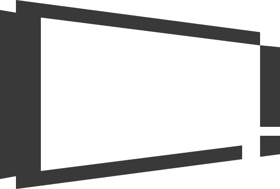

  
  &nbsp;&nbsp;&nbsp;&nbsp;&nbsp;&nbsp;&nbsp;&nbsp;
  

<h1 align="center">LectOS 1 | A rect-derived operating framework for CalXis</h1>

---

  A rect-derived operating framework for CalXis, an ESP32-S3 Based Axis Calculator.
   
  Built around mechanical-axis computation, binary states, and a post-industrial visual language.

